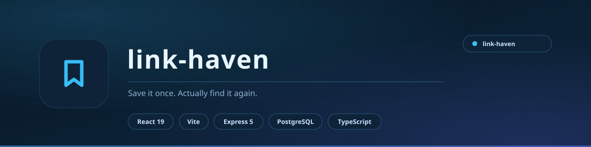

<div align="center">

<picture>
  <source media="(prefers-color-scheme: light)" srcset="docs/assets/banner-light.svg">
  <source media="(prefers-color-scheme: dark)" srcset="docs/assets/banner.svg">
  
</picture>

<br>

**Save it once. Actually find it again.**

A full-stack bookmark manager built around one idea: a saved link is worthless if you cannot rediscover it. Collections, tags, AI search and a command palette - all of it aimed at getting you back to the thing you meant to read.

<br>


<br>

[**Features**](#features) &nbsp;&nbsp;|&nbsp;&nbsp; [**Stack**](#stack) &nbsp;&nbsp;|&nbsp;&nbsp; [**Running it**](#running-it) &nbsp;&nbsp;|&nbsp;&nbsp; [**API**](#api) &nbsp;&nbsp;|&nbsp;&nbsp; [**Schema**](#database-schema)

</div>

---

## What it is

Most bookmark tools are a list. Link Haven is a **library**.

It understands what you saved - link, article, video, image, document, audio - and lets you slice by any of it: collection, tag, domain, type, date, or whether you ever actually read the thing. When you cannot remember where you put something, there is a full-text search and an AI panel that has read your whole library.

<div align="center">

|  |  |
|:---|:---|
| **Frontend** | React 19 + Vite, TailwindCSS, Framer Motion, shadcn/ui, Wouter |
| **Backend** | Express 5, Drizzle ORM, Zod validation |
| **Database** | PostgreSQL |
| **Monorepo** | pnpm workspaces, Node 24, TypeScript 5.9 |
| **API contract** | OpenAPI spec, Orval codegen, generated React Query hooks |
| **AI** | Gemini - chat, summarisation, auto-tagging, semantic search |
| **Build** | esbuild (CJS bundle) |

</div>

---

## Features

### The library

- **Save anything** - links, articles, videos, images, documents, audio
- **Collections** with custom colours, icons and live bookmark counts
- **Tags** with sidebar navigation and a visual tag cloud
- **Three view modes** - grid, list, and domain grouping
- **Full-text search** across titles, URLs, notes and tags

### AI, actually useful

- **Gemini chat panel** with the whole library as context - ask it what you saved about a topic
- **Auto-tagging** on save, so nothing lands untagged
- **Summarisation** for long articles you have not got to yet
- **Organise suggestions** - it proposes collections for loose bookmarks
- **Semantic search** through the AI Ask panel, not just keyword matching

The Gemini API key is stored **server-side and never returned to the frontend** - the settings UI only ever shows a masked value.

### Management

- **Pin to Speed Dial** for the handful you open daily
- **Bulk select** - archive, delete, tag or move in one go
- **Import** from Netscape HTML bookmarks; **export** to JSON or HTML
- **Duplicate detection** and a **broken-link checker**
- **Per-bookmark notes** and highlight storage

### Getting around

- **Command palette** - jump anywhere, do anything, without the mouse
- **Advanced filters** - type, date range, domain, tags, notes, pinned
- **Focus Mode / Reading List** - a clean reading surface with a mark-as-read flow
- **Reading-time estimate** on every bookmark
- **Recent activity** and an **analytics dashboard** - daily and weekly activity, top domains, top tags, content mix

---

## Stack

```
artifacts/
  link-haven/          React + Vite frontend  (the app)
  api-server/          Express 5 API          (serves /api)
  mockup-sandbox/      Vite component preview
lib/
  db/                  PostgreSQL schema + Drizzle
  api-spec/            OpenAPI spec (source of truth)
  api-zod/             Generated Zod schemas
  api-client-react/    Generated React Query hooks
```

The OpenAPI spec is the contract. Change it, run codegen, and the hooks and validators follow - the frontend and backend cannot drift apart silently.

---

## Running it

```bash
# install
pnpm install

# generate the API client from the OpenAPI spec
pnpm --filter @workspace/api-spec run codegen

# database
pnpm --filter @workspace/db run push

# API server
pnpm --filter @workspace/api-server run dev

# frontend
pnpm --filter @workspace/link-haven run dev
```

### Environment

| Variable | Purpose |
|:---|:---|
| `DATABASE_URL` | PostgreSQL connection string |
| `GEMINI_API_KEY` | Server-side only - powers chat, tagging and summaries |
| `SESSION_SECRET` | Session encryption |

> `GEMINI_API_KEY` is read by the API server only. It is never sent to the browser.

---

## Routes

| Path | Page |
|:---|:---|
| `/` | Landing page |
| `/login` | Login / signup |
| `/app` | Main library - supports `?view=favorites\|archive\|pinned\|recent\|domains` and `?tag=...` |
| `/app/collection/:id` | Single collection |
| `/settings` | Gemini key, profile, stats, keyboard shortcuts |
| `/analytics` | Analytics dashboard |

### Keyboard

| Key | Action |
|:---|:---|
| `Ctrl/Cmd + K` | Command palette |
| `Ctrl/Cmd + N` | New bookmark |
| `Ctrl/Cmd + J` | Toggle the AI chat panel |
| `Esc` | Close dialogs |

---

## API

| Method | Path | Purpose |
|:---|:---|:---|
| `GET` `PUT` | `/api/settings` | User settings (Gemini key stored masked) |
| `DELETE` | `/api/settings/gemini-key` | Remove the stored key |
| `POST` | `/api/gemini/test` | Test the Gemini connection |
| `POST` | `/api/gemini/chat` | Chat with the library as context |
| `POST` | `/api/gemini/summarize` | Summarise a bookmark |
| `POST` | `/api/gemini/auto-tag` | Generate tags for a bookmark |
| `POST` | `/api/gemini/organize` | Organisation suggestions |

---

## Database schema

| Table | Columns |
|:---|:---|
| `bookmarks` | id, userId, collectionId, url, title, type, tags[], isFavorite, isArchived, isPinned, note, highlight, readingTime, summary |
| `collections` | id, userId, name, color, icon |
| `user_settings` | id, userId, geminiApiKey, theme, defaultView, language |
| `sessions` | id, userId, token, expiresAt |

---

## Licence

MIT - see [LICENSE](LICENSE).

Built by **Aizenrex x Riyad**.
